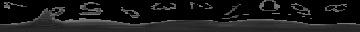

# Analog Meter Reader

The goal of this project is to create a python script using openCV thats able to both detect and determine the orientation of analog gas meters.
 ---
 1. Install python3
 2. Install opencv
 2. Run `python3 meter_reader.py` from root dir
 ---
 
 Ideally a camera would be placed on a static mount orthogonal and centered with the meter to take pictures at fixed time intervals. This script could then be configured to analyze the images taken and convert them into numerical data for statistical analysis. This is the original image I started with.
 

 
 Which I cropped to allow for fewer false positives when using Hough Circles. Given a fixed camera, the same cropping could be done on every image as a preprocessing step.
 
 
 
 The image is first converted to greyscale and slightly blured with a gaussian filter as a preprocessing step. To find the meters I run openCV's implementation of the Hough Circle algorithm, which is not ideal for a couple of reasons. First, there are a number of parameters that require tuning depending on the image, primarily min and max radius. Second, it returns many other circular things within the frame resulting in many false negatives. Third, it may fail to detect a meter as a circle. Depending on how you differentiate the meters, these last two issues can be very large problems and an alternate method of manually boxing or finding the centers of the meters would be more robust (you would probably need to use a similarity metric between the images to ensure the camera hasn't moved too much) but elminating detection would make life much easier. Regardless, here are the results of a tuned Hough Circle algorithm on the cropped image. 
 
 
 
 *Note all image processing is done using the greyscaled and blurred image, the original is just used to display results. 
 
 As you can see the algorithm does a fairly good job when tuned for the given image; however, some of the circles are misaligned which is an issue for my method to determine the orientation of the needles. To help resolve this I used the (rather large) assumption that the circles would be roughly on the dial but maybe not centered. My idea was to find the "center of mass" of the surrounding area in which dark pixels are weighted greater than light pixels, with the idea that it would result in a point closer to the true center than the original circle placement. This was accomplished by iterating over a square centered on the original circle with side lengths equal to half the radius. Below is a visualization of the square as well as the improved circle centers in red.
 
  
  
  The next task was to find the pixels that make up each of the 360 lines around the new centers which was accomplished using Bresenham's line algorithm, which unfortunately only can produce lines of slopes between 0 and 1 (pictured in green). I get the remaning lines by reflecting the initial ones accross combinations of the x axis, y axis, and y = x.
  
  
  
  Finally, to determine the orientation of the needle, I found the line with the lowest total pixel intensity (most dark pixels). This does a surprisingly good job for its simplicity.
  
  
  
  ## Future work
  
  There are still a number of glaring issues and I consider this project more of a proof of concept than a field ready program. If I were to return to this I first may look into eliminating the false negatives which currently is not done. One method could be to use plots of the lines generated around the center of each meter in which the x axis is the heading and the y axis is the pixels of the given line. The two false positives are clear outliers as one can see below.
  
  
  
  
  
  
  
  
  *False positives*
  
  
  

Plotting the lines this way also shows clearly visible peaks where the needles are. It seems like I could do a lot better both in accuracy of the heading and eleminating false positives by working with these.

Additionally, it may very well be that this method can be out done by convolutional neural networks both for detection and classification. If I find the time to put together a sufficiently large training/testing set I may give that a try.
